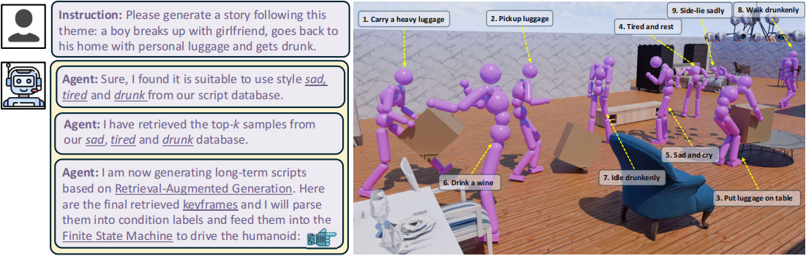

<h1 align="center">[ICCV2025] SIMS: Simulating Stylized Human-Scene Interactions<br>with Retrieval-Augmented Script Generation</h1>

<div align="center">
    <p>
        <a href="https://wenjiawang0312.github.io/">Wenjia Wang</a><sup>1</sup>  
        <a href="https://liangpan99.github.io/">Liang Pan</a><sup>1, 2</sup>  
        <a href="https://frank-zy-dou.github.io/">Zhiyang Dou</a><sup>1</sup>  
        <a href="https://blusque.github.io/">Jidong Mei</a><sup>1</sup>  
        <a href="https://zycliao.com/">Zhouyingcheng Liao</a><sup>1</sup>  
        <br>
        <a href="https://thorin666.github.io/">Yuke Lou</a><sup>1</sup>  
        <a href="https://littlecobber.github.io/">Yifan Wu</a><sup>1</sup>  
        <a href="http://yanglei.me/">Lei Yang</a><sup>2</sup>  
        <a href="https://wangjingbo1219.github.io/">Jingbo Wang</a><sup>2,†</sup>  
        <a href="https://i.cs.hku.hk/~taku/">Taku Komura</a><sup>1,†</sup>
    </p>
    <p>
        <sup>1</sup>The University of Hong Kong    
        <sup>2</sup>Shanghai AI Laboratory
    </p>
    <p>
        <sup>†</sup> Equal Advising
    </p>
</div>

<p align="center">
    <a href="https://arxiv.org/abs/2411.19921" target="_blank">
    
    </a>
    <a href="https://wenjiawang0312.github.io/projects/sims/" target="_blank">
    
    </a>
</p>




# 🗓️ News:

🎆 2025.Jun.26, SIMS has been accepted to ICCV2025, codes and data will be released soon.

# 🎓 Citation

If you find this project useful in your research, please consider citing us:

```
@inproceedings{wang2025sims,
title = {SIMS: Simulating Stylized Human-Scene Interactions with Retrieval-Augmented
  Script Generation.},
booktitle = {ICCV},
author = {Wenjia Wang, Liang Pan, Zhiyang Dou, Jidong Mei, Zhouyingcheng Liao, Yuke Lou, Yifan Wu, Lei Yang, Jingbo Wang, Taku Komura.},
year = {2025}
}
```

# 😁 Related Repos

# 📧 Contact

Feel free to contact me for other questions or cooperation: wwj2022@connect.hku.hk
